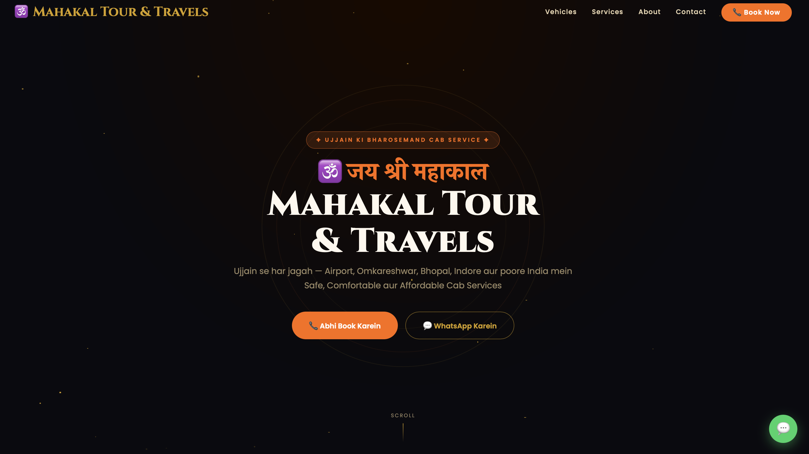
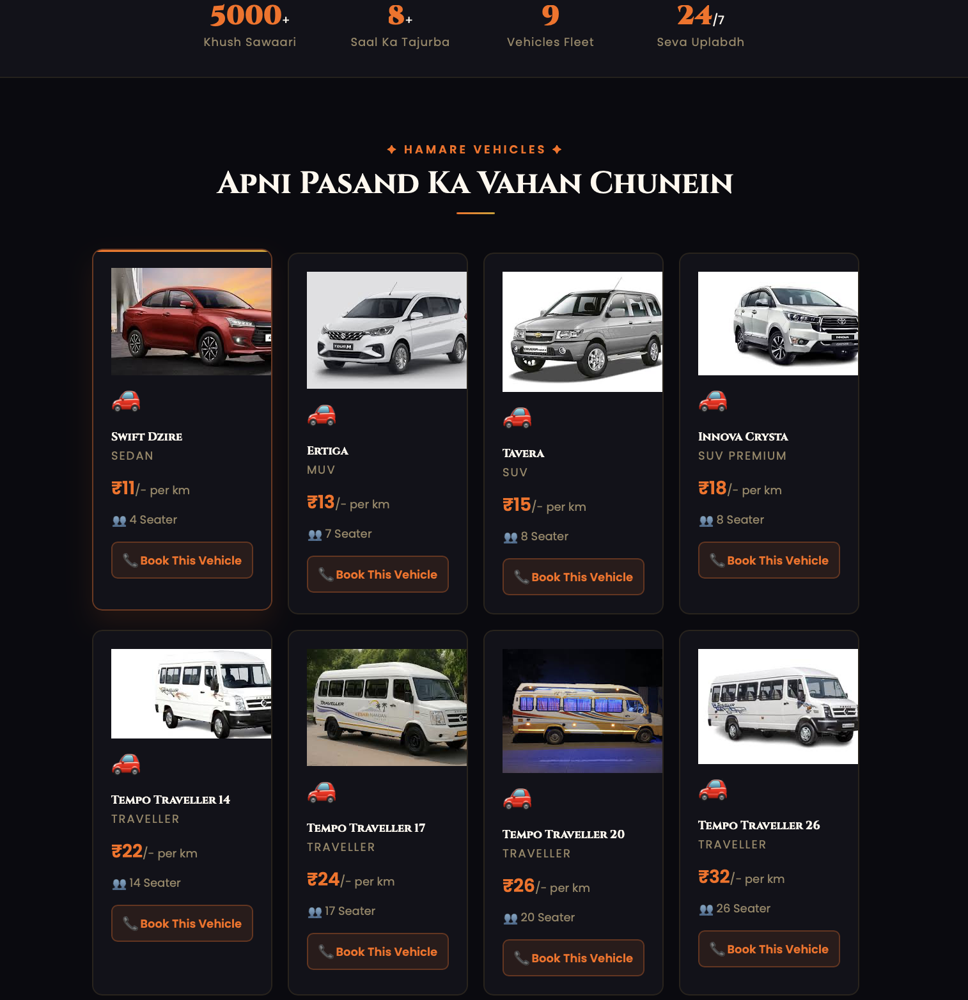
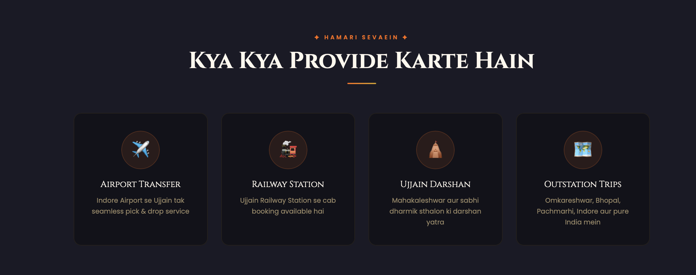
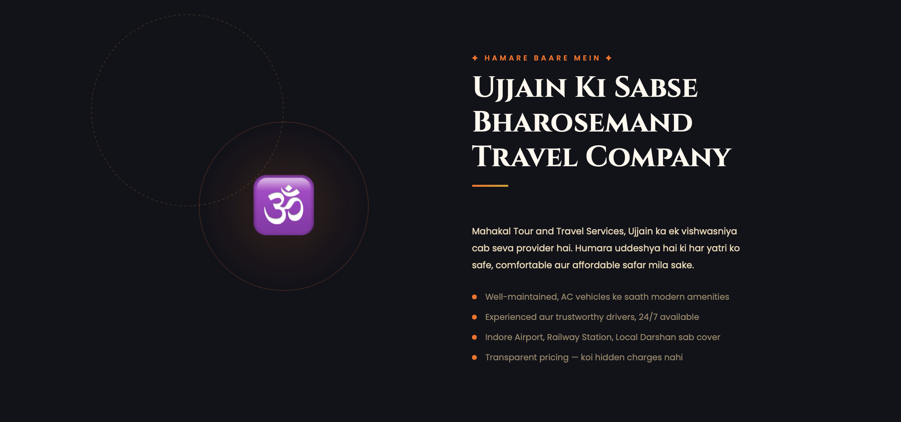
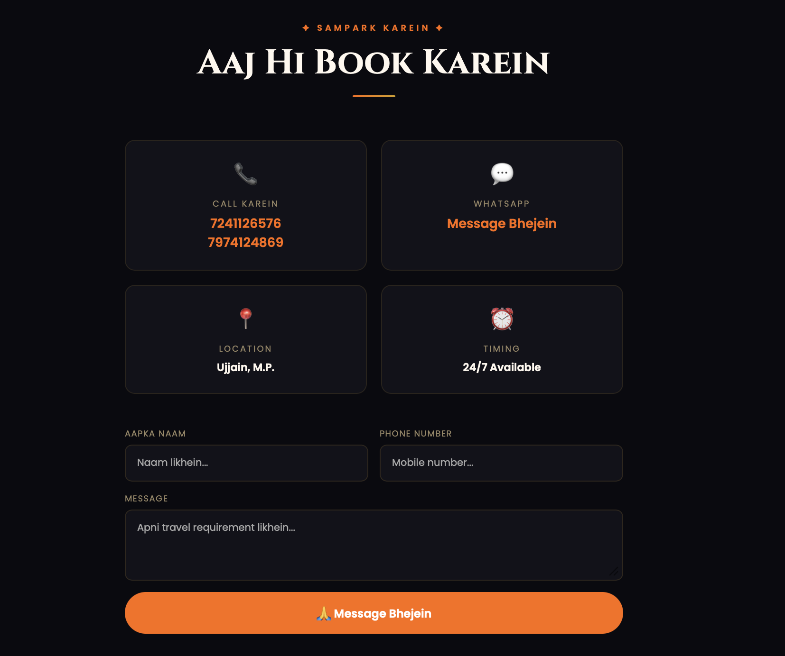

# 🕉️ Mahakal Tour & Travels — Django Travel Website

Modern Tour & Travel website built using Django with animated UI, vehicle services, travel routes, and responsive design.

---

## ✨ Features

- Full Animated Homepage
- Particle Effects & Scroll Animations
- Mahakal / Saffron Theme UI
- Vehicle Listing with Pricing
- Services Section
- About Us Section
- Floating Om Animation
- Contact Form (Django Backend Connected)
- WhatsApp Floating Button
- Responsive Design
- Smooth Navbar Effects
- Mobile Friendly Layout

---

## 🚀 Live Demo

https://mahakaltravels.onrender.com

---

## 📸 Screenshots

### Homepage


### Vehicles / Services


### Services


### About Section


### Contact Page


---

## 🛠️ Tech Stack

- Python
- Django
- HTML5
- CSS3
- JavaScript
- Bootstrap / Tailwind

---

## 📁 Project Structure

```text
mahakal_tours/
├── manage.py
├── requirements.txt
├── screenshots/
├── static/
├── templates/
├── mahakal_tours/
│   ├── settings.py
│   ├── urls.py
│   └── wsgi.py
└── home/
    ├── views.py
    ├── urls.py
    ├── models.py
    └── templates/home/
        └── index.html